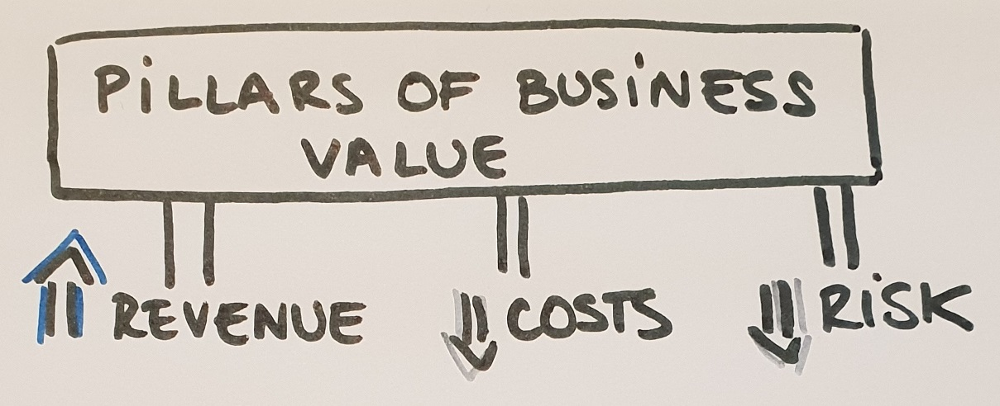
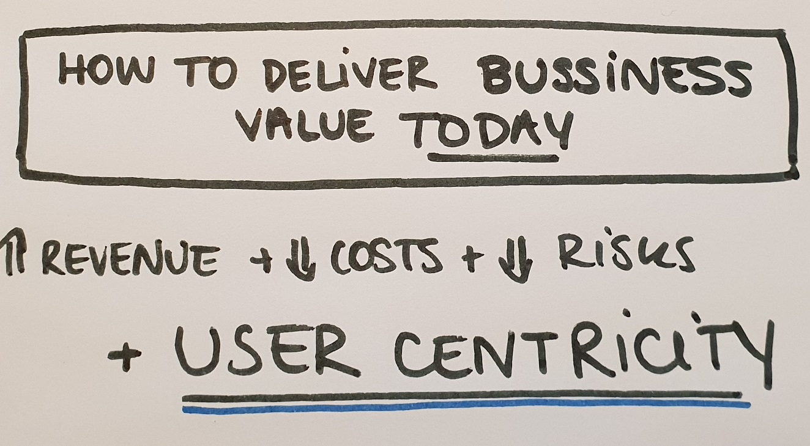

# Agile as an approach to digitial transformation
## What is digital transformation? 
Digital transformation has many definitions, because each company or business will go through digital transformation in a different way. Some of the core ideas that a digital transformation incorportates are the ability to change and adapt to the rapidly evolving digital world. It involves a shift in leadership, thinking, and encourages innovation and new business models. Often, companies undergo digital transformation not because they want to, but because they *need* to. We are in an age where companies that are unable to undertake appropriate digital transformations *will* fall behind, and fail. 
## The role of a manager is to deliver business value. / What is the role of a manager?
The core role of a manager is to deliver business value, and business value stands on a few important pillars. Traditionally the pillars of delivering business value are: 

{:height="75%" width="50%"}
  - Reducing costs
  - Reducing risks 
  - Increasing revenue
  
The manager therefore looks to oversee and maintain these pillars in a sustainable way, in order to continue to guarantee the delivery of business value. But today business value is something that is constantly changing, and changing fast. Users have access to nicer, cheaper and higher quality products and services all the time! And because these other products/services are so easily accessible, the user rapidly knows exactly what it wants and needs. This brings us to the importance of user centred development. User centricity is so important that it has become another pillar of business value. You could therefore say that the driving pillars of business value all revolve around user centricity today. 

## Project vs Product 
### Project mindset 
### Product mindset 
## What is the role of a manager now? 
## Risks 
