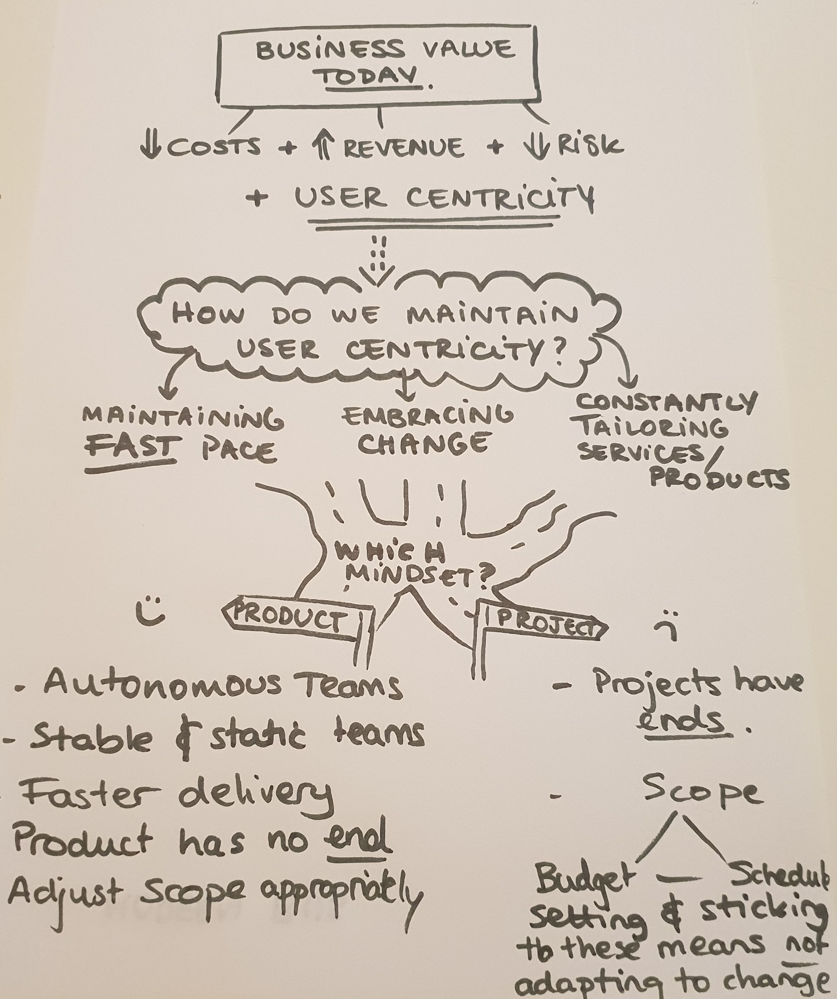

# Agile as an approach to digitial transformation

## What is digital transformation? 
Digital transformation has many definitions, because each company or business will go through digital transformation in a different way. Some of the core ideas that a digital transformation incorportates are the ability to change and adapt to the rapidly evolving digital world. It involves a shift in leadership, thinking, and encourages innovation and new business models. Often, companies undergo digital transformation not because they want to, but because they *need* to. We are in an age where companies that are unable to undertake appropriate digital transformations *will* fall behind, and fail. 

## The role of a manager is to deliver business value. / What is the role of a manager?

The core role of a manager is to deliver business value, and business value stands on a few important pillars. Traditionally the pillars for delivering business value are: 

  - Reducing costs
  - Reducing risks 
  - Increasing revenue
  
The manager therefore looks to oversee and maintain these pillars in a sustainable way, in order to continue to guarantee the delivery of business value. But today business value is something that is constantly changing, and changing fast. Users have access to nicer, cheaper and higher quality products and services all the time! And because these other products/services are so easily accessible, the user rapidly knows exactly what it wants and needs. This brings us to the importance of user centred development. User centricity is so important that it has become a new pillar of business value. You could therefore say that the driving pillars of business value all revolve around user centricity today. 

Without user centricity, companies can not go through a digital transformation.

It is only by focusing on the specific needs of the user that a business can hope to keep up with the evolving scope of their product/service. By keeping an end-user at the heart of what drives the product development, the end result is a lot more likely to be useful, meaningful, and usable.

## Project vs Product 

To take a look at what kind of philosophies/practices/mindsets are needed to adopt this user-centricity let's take a look at the differences between a project mindset and a product mindset. 

### Project mindset 

In the 50's projects became much more common. Introduced the role of project manager. The role of the project manager is to come up with a plan for a project, figure out how to carry out this plan and determine a schedule for everything, as well as come up with a budget to complete the project. This forms a project management triangle. 

As a good project manager, you delivery your project on time, on budget, and on scope. A project is nothing else than a container for all the activities that we lay out in sequence. This works very well if you are sure of what you are doing, and that the market around you does not evolve. 

Quote of former Nokia CEO "WE didn't do anything wrong, but somehow we lost." The market changed and people were no longer buying Nokias! By ignoring the change in the market and not adjusting the scope, Nokia lost. 

### Product mindset 

A  product mindset goes out into the market and tries to find out what the custommer really needs NOW. A product mindset wants to find out what challenges the end-user is having, what are the end-user's requirements, and how they can be helped in the most efficient way possible. By having a closer look at the end user's needs, you can have a more accurate scope for what you want to do, and from this figure out how to validate this scope. But the scope must be evaluated to extract what the highest possible value, and minimum viable product that can be produced in order to validate the assumption regarding the market. This can then be executed quickly and a working product can be pushed into the market to collect feedback.

## What is the role of a manager now? 

The role of the manager today is more of a 'Transformation leader'. The transformation leader's job is to enable and promote agile processes and development without impeding on autonomy. In fact, the leader must focus on removing impediments and promoting autonomy through agile coaching. Also importantly, the leader should facilitate conflict resolution and mediation. By encouraging a culture of respect, and trust, autonomous teams should strengthen and continue to be the most reliable and efficient way to

## Notes on the Agile Manifesto Principles

1) *Our highest priority is to satisfy the customer through early and continuous delivery of valuable software.* 

Today's projects are undeniably volatile and customer's needs must be re-evaluated frequently. This means that implementing a "customer value" must come before documentation, diagrams, and strictly following project plans. Business value and functionality is first and foremost delivered through working and usable software. 

2) *Welcome changing requirements, even late in the development. Agile processes harness change for the customer's competitive advantage.* 

Today's market is unpredictable, and this can cause turbulences in the development process. The only way to deal with these turbulences is to facilitate them, and take them as welcome change. 

3) *Deliver working software frequenctly, from a couple of weeks to a couple of months, with a preference for the shorter timescale.* 

An incremental style of software development is essential for agile projects. Reducing delivery time cycles invites more frequent feedback which enables everyone to evaluate and learn from the growing product. 

4) *Business people and developers work together daily throughout the project.* 

Agile developers should start the project with a high-level view of requirements that can be refined and detailed by frequent interactions between business people and developers. 

5) *Build projects around motivated individuals, give them the environment and support they need and trust them to get the job done.*

At the end of the day, it's your team that will make the difference between success and failure. Trust needs to be given to the people who know the most about the situation. 

6) *The most efficient and effective method of conveying information with and within a development team is face-to-face conversation.*

Documentation is important, but often an actual measure of how successful it is in transmitting knowledge is questionable. Tacit knowledge is best transfered by moving the people who have the knowledge around. Tacit knowledge can be described as the relationships among the facts, meaning that it is only by having people share their ideas about the facts that something useful can be applied to a specific situation. 

7) *Working software is the primary measure of progress* 

Today this could be expanded to be working and useable softare is the primary measure of progress. 

8) *Agile processes should promote sustainable development. The sponsors, developers and users should be able to maintain a constant pace indefinitely.* 

You need alert and creative people who can maintain their pace for the full length of the development project. A sustainable working pace is needed to maintain high productivity. 

9) *Continuous attention to technical excellence and good design enhances agility*

Agile development places particular importance on the quality of design. Because agile processes are iterative, each interaction should have design work, making technical cleanliness an essential part of the process. 

10) *Simplicity - the art of maximising the amount of work not done - is essential.*

Simple approaches are more than often the easiest to change. It's always easier to add on to a simple process than it is to a complicated one. Efficiency and clarity are essential to the agile process.

11) *The best architectures, requirements and designs emerge from self-organizing teams.* 

Self-organizing teams, where the interactions are high and the process rules are few, facilitate creativity and innovation. The best way to promote iterative processes and software development is to leave decisions and responsibility in the hands of those who are the closest them.

## Risks 

## A Summary diagram for all this 

